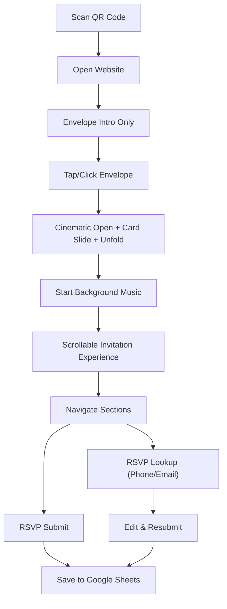

## 1. Product Overview
Premium one-page wedding invitation website with a cinematic envelope-opening intro and elegant scrolling sections, culminating in an RSVP form.
Designed for mobile-first guests arriving via QR code, with RSVP submissions stored in Google Sheets via Google Apps Script.

## 2. Core Features

### 2.1 Feature Module
1. **Invitation Experience (One Page)**: envelope intro → full invitation site with sections and smooth navigation.
2. **RSVP System**: submit RSVP, validate fields, and allow guests to look up and edit their existing submission (by phone or email).
3. **Performance & Polish**: luxury motion, responsive layout, lazy-loaded gallery, SEO metadata.

### 2.2 Page Details
| Page Name | Module Name | Feature description |
|-----------|-------------|---------------------|
| / | Intro (Envelope) | Centered envelope; click triggers a ~5s cinematic sequence: open → card slides out → unfolds; then enables scrolling experience and starts music |
| / | Sticky Navigation | Compact top navigation after intro; smooth-scroll to sections; highlights active section |
| / | Hero | Couple names, date; soft parallax background details; primary CTA scrolls to RSVP |
| / | Countdown | Live countdown to June 19, 2026 |
| / | Our Story | Timeline-style storytelling with scroll reveals |
| / | Wedding Timeline | Elegant schedule timeline (arrival → ceremony → photos → reception → dinner → program) |
| / | Entourage | Responsive grid for entourage roles and names; easy-to-edit data structure |
| / | Dress Code | Attire note; palette cards for Principal Sponsors, Family, Guests |
| / | Ceremony & Reception | Separate cards with addresses, directions buttons, and embedded maps |
| / | Venue Maps | Two embedded map blocks with quick “Open in Maps” links |
| / | Photo Gallery | Masonry layout; lightbox; lazy loading for images |
| / | Gift Registry | GCash placeholder, bank placeholder, note to guests |
| / | FAQ | Accordion with common questions |
| / | RSVP | Form validation; submit; lookup/edit flow; success states and friendly error handling |
| / | Contact | Contact cards for Bride and Groom |
| / | Footer | Minimal footer with date/location summary and small legal/credits line |

## 3. Core Process
Guest experience flow:
1. Guest scans QR and lands on the website.
2. The envelope intro is the only visible UI; guest taps/clicks to open it.
3. Intro animation plays; background music starts; site transitions into scrollable invitation.
4. Guest explores sections via scroll or sticky navigation.
5. Guest submits RSVP.
6. If needed, guest uses lookup to find a prior RSVP (phone/email) and edits it.

## 4. User Interface Design

### 4.1 Design Style
- Theme: Earthy Romantic Vintage Bohemian; softly luxurious, warm, airy, elegant.
- Color palette (tokens): Soft Creamy Peach (#FBCBA4), Dusty Rose (#D7A795), Deep Burgundy (#6C1613), Terracotta (#F49C76), Muted Dusty Blue (#9CBCCF).
- Typography:
  - Headings: elegant serif (e.g., Cormorant Garamond or EB Garamond).
  - Body: refined modern sans (e.g., Plus Jakarta Sans).
- Layout: generous whitespace, editorial spacing, subtle textures (grain/noise), delicate dividers and flourishes (avoid heavy shadows).
- Motion: one “hero moment” intro animation; then subtle scroll reveals, parallax accents, and refined hover interactions.

### 4.2 Page Design Overview
| Page Name | Module Name | UI Elements |
|-----------|-------------|-------------|
| / | Intro (Envelope) | Center composition, tactile paper texture, wax seal detail, staged lighting, timed sequence (~5s), “Tap to open” microcopy |
| / | Navigation | Sticky, semi-translucent, blur + grain, active-section highlight, smooth scroll |
| / | Sections | Alternating airy panels, floral/boho accents, restrained borders, consistent rhythm |
| / | Gallery | Masonry grid, graceful lightbox, progressive loading, captions optional |
| / | RSVP | Premium form styling, clear states, inline validation, lookup/edit flow with minimal friction |

### 4.3 Responsiveness
- Mobile-first with touch-friendly targets, reduced-motion preferences respected, and animations tuned for 60fps on mid-range devices.
- Breakpoints scale up to tablet/desktop with larger typography, more columns, and enhanced parallax.
