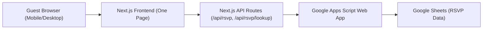
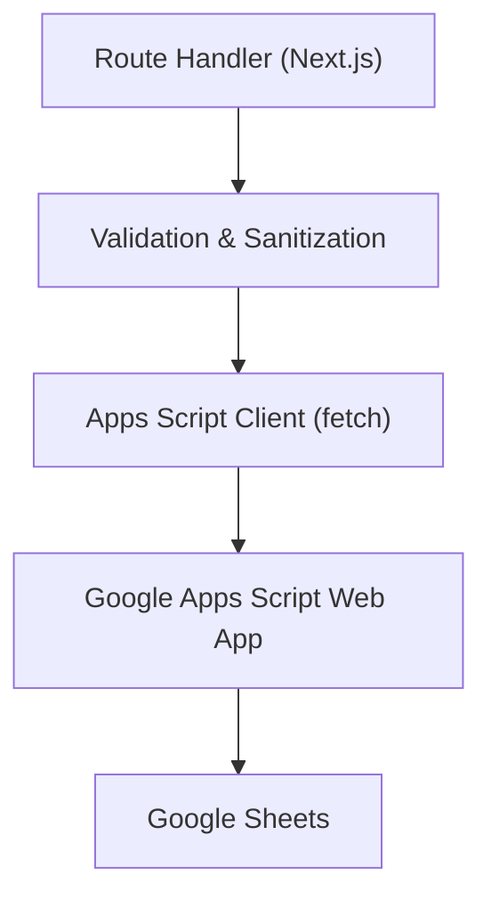
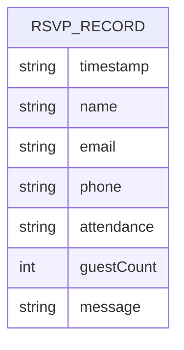

## 1. Architecture Design



## 2. Technology Description
- Frontend: Next.js (App Router) + React + Tailwind CSS
- Runtime: Vercel serverless (for Next.js API routes)
- External Services: Google Apps Script (HTTP endpoint) + Google Sheets
- Audio: local mp3 asset (autoplay after user interaction); optional mute toggle

## 3. Route Definitions
| Route | Purpose |
|-------|---------|
| / | One-page invitation experience (intro + sections + RSVP) |
| /api/rsvp | Create or update RSVP (server → Apps Script) |
| /api/rsvp/lookup | Lookup RSVP by email or phone (server → Apps Script) |

## 4. API Definitions (Next.js → Apps Script)

### 4.1 Environment Variables
- GOOGLE_SCRIPT_URL: deployed Apps Script Web App URL
- GOOGLE_SCRIPT_TOKEN: shared secret token for server-to-script requests
- NEXT_PUBLIC_SITE_URL: used for absolute SEO URLs (optional)

### 4.2 Types
```ts
export type Attendance = "yes" | "no";

export type RsvpUpsertRequest = {
  name: string;
  email: string;
  phone: string;
  attendance: Attendance;
  guestCount: number;
  message?: string;
};

export type RsvpLookupRequest = {
  email?: string;
  phone?: string;
};

export type RsvpRecord = {
  timestamp: string;
  name: string;
  email: string;
  phone: string;
  attendance: Attendance;
  guestCount: number;
  message: string;
};

export type ApiOk<T> = { ok: true; data: T };
export type ApiErr = { ok: false; error: string };
```

### 4.3 Apps Script Request Shape
Next.js API routes POST JSON to Apps Script:
- Headers: `Content-Type: application/json`, `X-Token: <GOOGLE_SCRIPT_TOKEN>`
- Body:
  - `{ action: "upsert", payload: RsvpUpsertRequest }`
  - `{ action: "lookup", payload: RsvpLookupRequest }`

### 4.4 Apps Script Response Shape
- Success: `{ ok: true, data: ... }`
- Failure: `{ ok: false, error: "..." }`

## 5. Server Architecture Diagram (Next.js API Routes)



## 6. Data Model

### 6.1 Data Model Definition
Google Sheets tab: `RSVP`
Columns:
1. Timestamp
2. Name
3. Email
4. Phone
5. Attendance
6. Guest Count
7. Message



### 6.2 Data Definition Language
Not applicable (Google Sheets).
