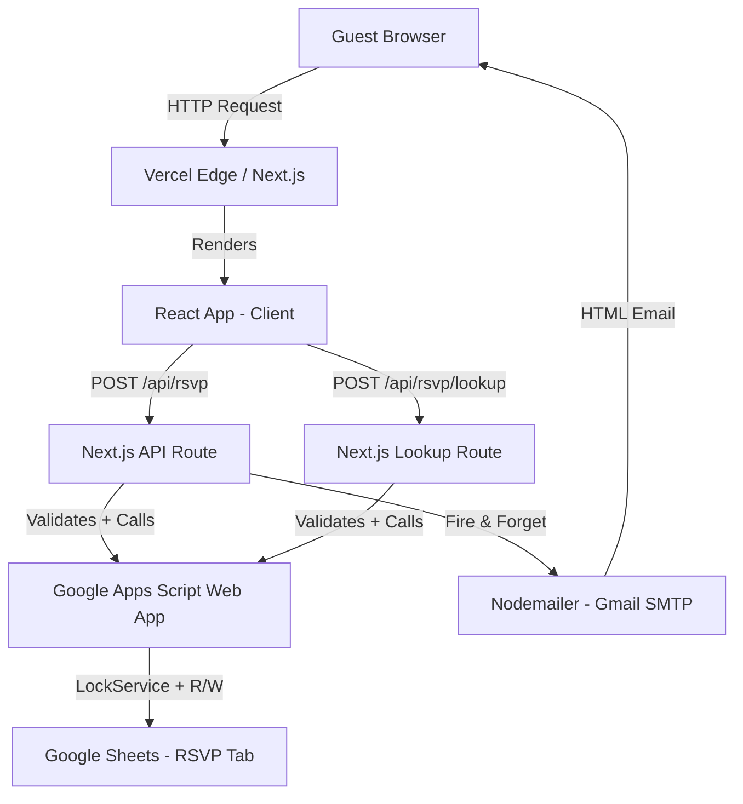
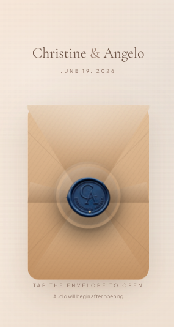
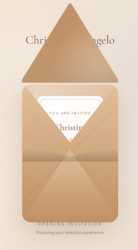
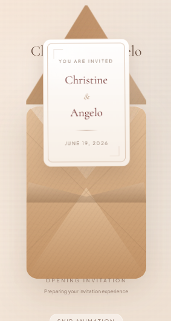
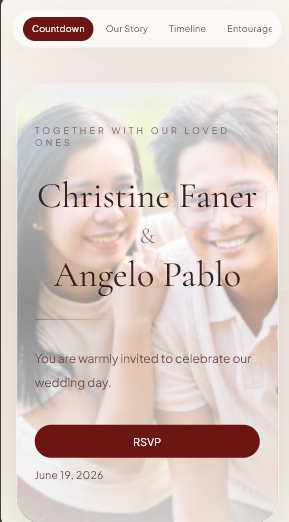
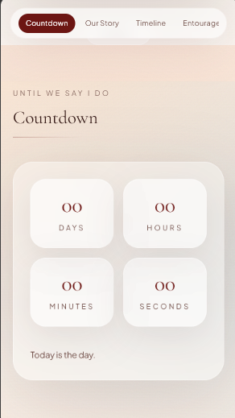
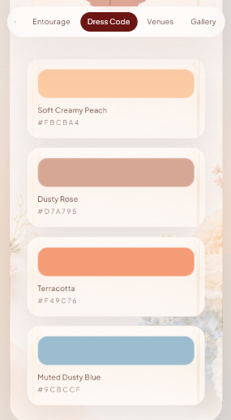
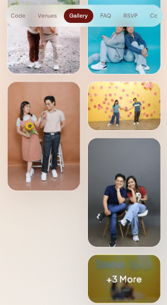
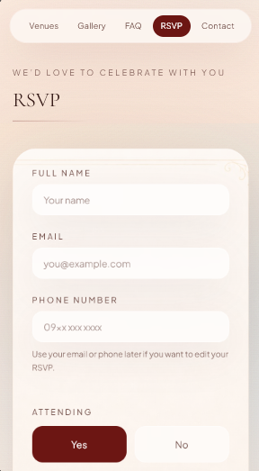

# 💍 Wedding RSVP Platform

> A full-stack, serverless wedding invitation and RSVP management platform built with Next.js 14 — featuring a multi-phase 3D envelope animation, real-time countdown, Google Sheets persistence via Apps Script, and transactional email delivery.


---

## Project Overview

This project is a bespoke digital wedding invitation and RSVP platform for a real wedding, built to replace static paper invitations and ad-hoc guest tracking. The primary goals were:

- Deliver a premium, memorable first impression through rich UI animation
- Give guests a seamless, mobile-first RSVP experience with zero friction
- Provide the couple with automatic, real-time guest registration via Google Sheets
- Eliminate manual RSVP tracking with idempotent upsert semantics and automated email confirmation

The system targets non-technical end users (wedding guests) who interact through a polished, guided interface, while the couple benefits from a zero-maintenance backend powered by familiar Google Workspace tooling.

---

## Project Highlights

### Experience & Animation

- **Multi-phase 3D envelope animation** with six discrete states (`idle → seal → open → lift → reveal → complete`), driven by a sequenced `setTimeout` scheduler and CSS `perspective`/`rotateX` transforms
- **Accessibility-aware motion** — `prefers-reduced-motion` is detected via a custom React hook; all animation phases are bypassed and the experience jumps directly to `complete`
- **Parallax Hero ornaments** using a `requestAnimationFrame`-throttled scroll listener and `translate3d` hardware-accelerated transforms
- **Background music player** with toggle controls, wired to the envelope's `onUserGesture` callback to comply with browser autoplay policies

### RSVP System

- **Dual-mode form** — lookup by email or phone pre-fills the form for returning guests; upsert semantics ensure records are created or updated in a single operation
- **Honeypot spam filter** — a hidden `website` field silently rejects bot submissions without revealing the mechanism
- **Timing-based bot detection** — submissions under 1.2 seconds from form render are rejected server-side
- **Server-side validation mirrored on the backend** — both the Next.js API route and the Google Apps Script independently validate all inputs with clamped bounds, preventing data corruption at every layer
- **Non-blocking email delivery** — confirmation emails are fire-and-forget; RSVP success is not gated on email delivery

### Data Layer

- **Distributed lock on writes** — Google Apps Script uses `LockService.getScriptLock()` with an 8-second wait to prevent race conditions on concurrent upserts to the same spreadsheet row
- **Normalized identity resolution** — email and phone are independently normalizable; `findRow_()` resolves existing records by either field, enabling guests to RSVP with either contact detail

---

## Technology Stack

| Layer           | Technology                               | Rationale                                                                                             |
| --------------- | ---------------------------------------- | ----------------------------------------------------------------------------------------------------- |
| **Framework**   | Next.js 14 (App Router)                  | Edge-ready serverless API routes, file-based routing, RSC-compatible layout                           |
| **Language**    | TypeScript 5                             | End-to-end type safety across API contracts, shared types between client and server                   |
| **Styling**     | Tailwind CSS v4                          | Utility-first with PostCSS pipeline; v4's zero-config setup removes the need for `tailwind.config.js` |
| **Fonts**       | Cormorant Garamond + Plus Jakarta Sans   | Serif/sans pairing — editorial elegance with modern UI legibility                                     |
| **Animations**  | CSS Keyframes, 3D Perspective Transforms | Native browser rendering; no JS animation library overhead                                            |
| **UI Feedback** | SweetAlert2 + React Content              | Accessible modal dialogs for RSVP states without custom modal boilerplate                             |
| **Backend**     | Next.js API Routes (serverless)          | Co-located with the frontend; no separate server or containerization required                         |
| **Database**    | Google Sheets via Apps Script            | Zero-cost, zero-ops persistence with familiar access for non-technical stakeholders                   |
| **Email**       | Nodemailer (Gmail SMTP)                  | Lightweight transactional email without a paid email service dependency                               |
| **Analytics**   | Vercel Analytics                         | Zero-config, privacy-respecting pageview tracking                                                     |
| **Deployment**  | Vercel                                   | Git-push deployments, automatic edge CDN, and environment variable management                         |

---

## Architecture

### Overview

The system is composed of three layers: a statically rendered React frontend, a serverless Next.js API tier, and a Google Workspace backend acting as both the database and the deployed API endpoint.



### Request Flow — RSVP Submission

1. **Client** submits the RSVP form; the `startedAt` timestamp is injected at form render time.
2. **`/api/rsvp` (POST)** parses and validates all fields — name, email, phone, attendance, guest count — with strict type coercion and clamped numeric bounds.
3. The **honeypot** field and **timing check** are evaluated server-side before any downstream call.
4. **`callAppsScript()`** constructs an authenticated POST to the deployed Apps Script Web App URL, appending a shared secret token as a query parameter.
5. **Apps Script `doPost()`** re-validates the token, acquires a distributed `ScriptLock`, and performs an upsert: lookup by email/phone → update row if found, append row if not.
6. On success, **`sendRsvpConfirmation()`** fires asynchronously — errors are caught and logged without affecting the client response.
7. The API returns `{ ok: true }` or `{ ok: false, error }` with appropriate HTTP status codes.

### Security Architecture

- The Apps Script endpoint is authenticated via a shared secret token (`RSVP_TOKEN`), validated on both the query parameter and `X-Token` header.
- The token is stored as a Google Script Property (server-side secret) and as a Vercel environment variable — never exposed to the client bundle.
- `GOOGLE_SCRIPT_URL`, `EMAIL_USER`, and `EMAIL_PASS` are server-only environment variables, inaccessible to the browser.

---

## Folder Structure

```
wedding-rsvp-trae/
├── apps-script/
│   └── Code.gs              # Google Apps Script — doPost handler, upsert_, lookup_, LockService
├── src/
│   ├── app/
│   │   ├── api/
│   │   │   └── rsvp/
│   │   │       ├── route.ts         # POST /api/rsvp — upsert with validation & email trigger
│   │   │       └── lookup/
│   │   │           └── route.ts     # POST /api/rsvp/lookup — identity resolution
│   │   ├── layout.tsx               # Root layout, font loading, Vercel Analytics, SEO metadata
│   │   └── page.tsx                 # Entry point — mounts ClientApp
│   ├── components/
│   │   ├── IntroEnvelope.tsx        # 3D multi-phase envelope animation (411 lines)
│   │   ├── AudioPlayer.tsx          # Background music with autoplay-policy compliance
│   │   ├── Accordion.tsx            # Accessible FAQ accordion
│   │   ├── Reveal.tsx               # Intersection Observer scroll-reveal wrapper
│   │   ├── StickyNav.tsx            # Section-aware sticky navigation
│   │   └── ...                      # Button, Container, Field, MapEmbed, Section
│   ├── hooks/
│   │   └── usePrefersReducedMotion.ts  # Window matchMedia hook for accessibility
│   ├── lib/
│   │   ├── server/
│   │   │   ├── appsScriptClient.ts  # Typed fetch wrapper for Apps Script calls
│   │   │   └── email.ts             # Nodemailer transport + HTML email templates
│   │   ├── rsvp.ts                  # Shared TypeScript types (RsvpUpsertRequest, RsvpRecord, ApiOk/ApiErr)
│   │   ├── utils.ts                 # clamp(), cn(), isValidEmail(), isValidPhone()
│   │   └── wedding.ts               # Typed wedding data — venue, timeline, entourage, FAQ
│   └── sections/                    # 14 modular page sections (Hero, Countdown, RSVP, Gallery, etc.)
├── public/
│   ├── audio/                       # Piano background music
│   ├── background/                  # Texture images for email + UI backgrounds
│   ├── gallery/                     # Pre-wedding photos, attire guides, QR codes
│   └── intro/                       # Wax seal PNG
└── docs/                            # Component map, deployment guide, QR printing guide
```

---

## Engineering Decisions

### 1. Google Sheets as the Database

**Decision:** Use Google Apps Script as a deployed Web App backed by Google Sheets instead of a traditional database (Supabase, PlanetScale, etc.).

**Reasoning:** The couple is non-technical. A Google Sheet provides a familiar, shareable, zero-maintenance view of all RSVPs without requiring a database admin or third-party dashboard. The trade-off is throughput — Google Apps Script has execution time limits and lacks horizontal scalability — but for a wedding RSVP use case (bounded, low-concurrency writes), this is an acceptable constraint.

**Mitigation:** `LockService.getScriptLock()` with an 8-second wait prevents data corruption from concurrent writes.

### 2. Upsert Semantics for RSVP

**Decision:** RSVP submissions are idempotent upserts, not append-only inserts.

**Reasoning:** Guests frequently change their plans. An append-only model would require manual deduplication. The identity resolution logic in `findRow_()` matches by email OR phone, so a guest who RSVPs twice with the same contact detail has their record updated in-place.

### 3. Shared Type Contract Between API and Client

**Decision:** `RsvpUpsertRequest`, `RsvpLookupRequest`, `RsvpRecord`, `ApiOk<T>`, and `ApiErr` are defined once in `src/lib/rsvp.ts` and imported by both the API route and the client-side RSVP form.

**Reasoning:** Eliminates the risk of client/server type drift. The TypeScript compiler catches any breaking changes to the API contract at build time.

### 4. Fire-and-Forget Email Delivery

**Decision:** `sendRsvpConfirmation()` is called with `await` inside a `try/catch` block, but failures are logged and silently swallowed — the RSVP response is not conditional on email delivery.

**Reasoning:** SMTP delivery is unreliable and latency-variable. Blocking the RSVP response on email delivery would degrade UX for an operation that has already succeeded. Email is a secondary confirmation, not a primary record.

### 5. CSS-Native 3D Animation Over JS Libraries

**Decision:** The envelope animation is implemented entirely with CSS `perspective`, `rotateX`, `translateY`, `backfaceVisibility`, and `transform-style: preserve-3d` — no GSAP, Framer Motion, or animation library.

**Reasoning:** Zero additional JS bundle weight. Browser compositing handles hardware acceleration natively. The `envelopeFloat` idle animation is a CSS `@keyframes` loop, keeping the main thread free.

### 6. Accessibility as a First-Class Constraint

**Decision:** `usePrefersReducedMotion()` is evaluated before every animated component renders. Reduced-motion users skip directly to the post-animation experience with no layout shift.

**Reasoning:** Animation-heavy experiences can trigger vestibular disorders. Respecting the OS-level preference is a baseline accessibility requirement, not an enhancement.

---

## Technical Highlights

### Multi-Phase Envelope State Machine

The `IntroEnvelope` component models a 6-state sequence (`idle → seal → open → lift → reveal → complete`) using a `setTimeout`-based scheduler stored in a `useRef` array. Scheduled timers are tracked and cleared on unmount via a `useEffect` cleanup, preventing state updates on unmounted components.

```
idle (0ms) → seal (0ms) → open (+260ms) → lift (+1425ms) → reveal (+2625ms) → complete (+3525ms)
```

Each phase transition triggers CSS class changes that drive `transition-transform`, `transition-opacity`, and `backdrop-filter` progressions without a single imperative DOM manipulation.

### Distributed Lock on Concurrent Writes

The Apps Script `upsert_()` function wraps the read-modify-write sequence in a `LockService.getScriptLock()` call:

```javascript
var lock = LockService.getScriptLock();
lock.waitLock(8000);
try {
  // read → find row → write
} finally {
  lock.releaseLock();
}
```

This ensures that two simultaneous guests with the same phone number cannot both pass the `findRow_()` check and each append a new row.

### Layered Input Validation

Validation occurs at three independent layers:

| Layer                   | Mechanism                                                               | Catches                                                        |
| ----------------------- | ----------------------------------------------------------------------- | -------------------------------------------------------------- |
| Client                  | HTML `required`, `type="email"`                                         | Empty fields, malformed email on legacy browsers               |
| API Route (`route.ts`)  | TypeScript type coercion, `isValidEmail()`, `isValidPhone()`, `clamp()` | Type mismatch, out-of-range guest count, timing bots, honeypot |
| Apps Script (`Code.gs`) | Re-validates all fields before any sheet write                          | Requests that bypass the Next.js layer entirely                |

### Inline CID Attachments for Email

Confirmation emails embed a wedding-palette background image using `cid:` inline attachments via Nodemailer, avoiding the rendering inconsistencies of external image URLs in email clients.

---

## Challenges & Solutions

### Challenge 1: Browser Autoplay Policy

**Problem:** Background music cannot autoplay without a prior user gesture. The envelope animation and the audio player are separate components with no direct coupling.

**Solution:** The `IntroEnvelope` component exposes an `onUserGesture` callback prop. When the guest taps the envelope (the `start()` function), `onUserGesture` fires before any phase transition. The parent `ClientApp` wires this callback to the `AudioPlayer`'s `play()` method, which is now allowed by the browser because it executes within the same event handler tick.

**Trade-off:** The audio player's play state is coupled to the intro flow. Guests who skip the animation via the "Skip animation" button must manually toggle audio — acceptable, since they made an explicit skip gesture.

### Challenge 2: Concurrent RSVP Writes to Google Sheets

**Problem:** Google Sheets has no row-level locking. Two guests registering simultaneously could both read an empty row set and both append, resulting in duplicate records.

**Solution:** `LockService.getScriptLock()` serializes writes at the Apps Script level. The 8-second wait is aggressive — it degrades a single request's latency but guarantees data integrity for a use case where correctness outweighs performance.

### Challenge 3: Guest Identity Resolution

**Problem:** A guest might RSVP with their email, then later update using only their phone number (or vice versa). A pure email-keyed lookup would create a second record.

**Solution:** `findRow_()` scans both normalized email and normalized phone independently. If either matches, the existing row is returned. The phone normalization strips all non-digit characters before comparison, handling formats like `+63-917-xxx-xxxx` and `09171234567` as equivalent.

### Challenge 4: Accessible Animation Without Library Overhead

**Problem:** A rich 3D animation experience that also respects `prefers-reduced-motion` — without adding Framer Motion or GSAP to the bundle.

**Solution:** A single `usePrefersReducedMotion()` hook wrapping `window.matchMedia('(prefers-reduced-motion: reduce)')` is checked at the start of every component that animates. Reduced-motion users see the post-animation state immediately. Full-motion users experience the sequenced CSS transform chain. Zero JS animation library cost.

---

## Lessons Learned

1. **Google Apps Script is a viable serverless backend** for low-throughput, event-scoped applications — especially when the data consumer (the couple) prefers a spreadsheet interface over any dashboard.
2. **Shared TypeScript types between client and server** are one of the highest-leverage patterns in a Next.js monorepo. The single `rsvp.ts` file prevented an entire class of API contract bugs.
3. **CSS-native 3D transforms are more capable than commonly assumed.** `preserve-3d`, `backface-visibility`, and `perspective` can produce convincing physical simulations without any JavaScript animation orchestration.
4. **Fire-and-forget async patterns require intentional error boundaries.** The email try/catch pattern works, but in a production system with SLAs, this would be replaced with a job queue (e.g., Vercel's background functions or a queue service) for observability and retry semantics.
5. **LockService is a blunt instrument.** It works, but it introduces latency. For a higher-throughput system, a proper database with `UPSERT ... ON CONFLICT` semantics would be the correct solution.

---

## Future Improvements

| Area                   | Enhancement                                                                                                        |
| ---------------------- | ------------------------------------------------------------------------------------------------------------------ |
| **Analytics**          | Per-section scroll depth tracking; RSVP funnel conversion rates                                                    |
| **Admin Panel**        | A password-protected `/admin` route with real-time RSVP count, attendance breakdown, and guest list export         |
| **Queue-based Email**  | Replace fire-and-forget with a Vercel background function or Resend/SendGrid for delivery receipts and retry logic |
| **Rate Limiting**      | IP-based rate limiting on `/api/rsvp` using Vercel Edge Middleware to prevent submission flooding                  |
| **i18n**               | Multi-language support (Filipino / English) using `next-intl`                                                      |
| **Optimistic UI**      | Optimistic form state update on submission with server reconciliation on response                                  |
| **Media Optimization** | Automated `next/image` AVIF conversion pipeline for gallery images                                                 |

---

## Project Gallery

**Intro — 3D Envelope Animation**

| Closed | Opening | Revealed |
|:---:|:---:|:---:|
|  |  |  |

**Main Invitation Sections**











---

## Acknowledgements

- **[Google Apps Script](https://developers.google.com/apps-script)** — serverless spreadsheet backend
- **[Nodemailer](https://nodemailer.com/)** — SMTP email delivery
- **[SweetAlert2](https://sweetalert2.github.io/)** — accessible modal dialogs
- **[Vercel Analytics](https://vercel.com/analytics)** — privacy-first pageview tracking
- **[Cormorant Garamond](https://fonts.google.com/specimen/Cormorant+Garamond)** — primary display typeface

---

## License

MIT © 2026 — Built for Christine & Angelo's Wedding
